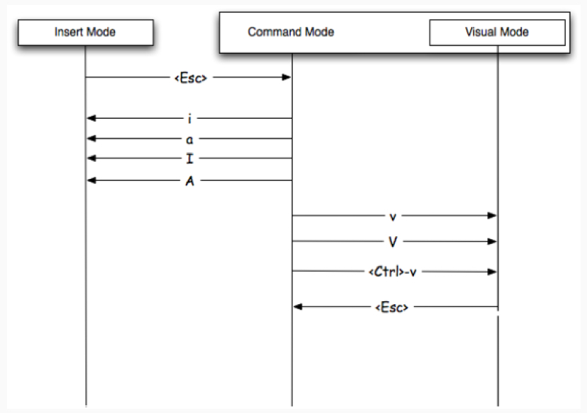

 <hr/>          
<p align="center">
    
</p>
<hr/>
<hr/>

# Vim Cheatsheet
<hr/>

- [Vim Cheatsheet](#vim-cheatsheet)
        - [Entering and leaving vi](#entering-and-leaving-vi)
        - [Buffer Management](#buffer-management)
        - [File management](#file-management)
        - [Movement commands](#movement-commands)
        - [Scrolling](#scrolling)
        - [Insert](#insert)
        - [Delete](#delete)
        - [Changing Case](#changing-case)
                - [examples](#examples)
        - [Replace Mode](#replace-mode)
        - [Undo Redo and Repeat](#undo-redo-and-repeat)
        - [Copy and Paste](#copy-and-paste)
        - [Searching](#searching)
            - [wild card or meta character while searching](#wild-card-or-meta-character-while-searching)
            - [Search and replace](#search-and-replace)
        - [Indent Auto-indent and Word wrap](#indent-auto-indent-and-word-wrap)
        - [Filtering through shell commands](#filtering-through-shell-commands)
        - [Modes](#modes)
        - [Marks](#marks)
        - [Jump through history](#jump-through-history)
        - [Windows](#windows)
        - [Abbreviations](#abbreviations)
        - [Command](#command)
        - [Diff](#diff)
        - [Settings](#settings)

### Entering and leaving vi
- vi file edits existing or new file
- [Shift] + ZZ writes file and quits (or :wq[Return] )
- :q![Return] quits without saving changes (or [Shift] + ZQ)

<table>
    <tbody>
            <tr>
            <td> <b> Verbs </td>
            <td> <b>d - delete <br>c - change <br>y - yank (copy) <br>v - visually select
            </td>
            </tr>
            <tr>
            <td> <b> Modifiers </td>
            <td> <b>i - inside<br>a - around<br>NUM - number (1,2,10)<br>t - searches for something and stops before it<br>f - searches for that thing and lands on it
            </td>
            </tr>
            <tr>
            <td> <b> Nouns </td>
            <td> <b>w - word<br>s - sentence<br>p - paragraph<br>t - tag (think HTML/XML)<br>b - block (think programming)
            </td>
            </tr>
            <tr>
    </tbody>
</table>


### Buffer Management
```vim
:buffers "list open buffers
:ls "list open buffers
:list buffers "list open buffers
:b [TAB] "to cycle through buffers
:bp "previous buffer
:bn "next buffer
:bd "to delete contents in current buffer
:b<number> "number of buffer from ls
```

### File management

- need to be in normal mode
  
```vim
:w "Write without quitting 
:q "Quit without writing
:q! "Abandon changes 
:vi "Edit another file
:e "Edit another file
:n "Go to next file 
:N "Go to previous file
:rew "Rewind to first file
:r "Read file into this one
:-1r <file name> "Read file to line before
:e "to open a file
:e . " ls of the current directory
:e! " back to last saved
```

### Movement commands

- need to be in normal/command mode
  
```vim
w "forward a word
3w "to move forward 3 words, you use numeric prefix in almost all vi commands
b "back a word
e "forward to end of the current or next word
) "forward a sentance
( "backward a sentance
} "forward a paragraph
{ "backward a paragraph
^ "move the cursor to the beginning of a line
0(zero) "will move to beginning of the line
$ "move the cursor to the end of the line
:$ "end of the file
GA "end of thr file
3j6w "this will move 3 lines down and 6 words to left
- (minus) "goes to the beginning of the previous line
1G or gg(lower case) "i.e 1+shift+g # first line of the file
G "i.e shift+g # last line of the file
% " % All lines (same as 1,$)
ctrl+f " page down
ctrl+b "page up
'. "(single quote period i.e dot) to go to last change
```

### Scrolling
```shell
• [Control] + e   #Scroll down one line (“expose”)
• [Control] + y   #Scroll up one line
• [Control] + d   #Scroll down half a screen
• [Control] + u   #Scroll up half a screen
• [Control] + f   #Scroll down one screen (“forward”)
• [Control] + b   #Scroll up one screen (“back”)
```
### Insert

- All of these commands enter insert mode
  
```vim
i "to insert text at the cursor
a "to append text 
I "to insert at the beginning of the line
A "to insert at the end of the line
o "to open a new line below the cursor
O "to open a new line above the cursor 
vi <filename> +<line number> " to start editor on a line - eg: vi test.txt +8 will open file test.txt on line 8
Ctrl-n "to insert the next matching word
Ctrl-p "to insert the previous matching word
```

### Delete

- Can use dx, where x is any movement command
- Can use a number before any deletion command

```vim
x "deletes the current character at the cursor
dd "deletes current line
d2w "delete two words
dw "deletes current word, also deletes white space after the word
de "deletes the current word to end of the word with out deleting the white space after the word
d^ "deletes to beginning of line
d$ or D "deletes to end of line
d() "deletes current sentence 
```

 ### Change Text
```vim
r "changes the current character # r leaves in command mode
s "changes the current character # s leaves in command mode
cc "changes the current line, deletes the contents in current line and leaves you in insert mode
cw (also ce) "changes the current word and leaves you in insert mode
c^ "changes to beginning of line
c$ (also C) "changes to end of line
```
### Changing Case
<table class="Change case">
    <tbody>
        <tr>
            <th>Command </th>
            <th> Description
            </th>
        </tr>
        <tr>
            <td> <code>~</code> </td>
            <td> Toggle case of the character under the cursor, or all visually-selected characters.
            </td>
        </tr>
        <tr>
            <td> <code>3~</code> </td>
            <td> Toggle case of the next three characters.
            </td>
        </tr>
        <tr>
            <td> <code>g~3w</code> </td>
            <td> Toggle case of the next three words.
            </td>
        </tr>
        <tr>
            <td> <code>g~iw</code> </td>
            <td> Toggle case of the current word (inner word – cursor anywhere in word).
            </td>
        </tr>
        <tr>
            <td> <code>g~$</code> </td>
            <td> Toggle case of all characters to end of line.
            </td>
        </tr>
        <tr>
            <td> <code>g~~</code> </td>
            <td> Toggle case of the current line (same as <code>V~</code>).
            </td>
        </tr>
        <tr>
            <td> <code>U</code> </td>
            <td> Uppercase the visually-selected text.<br/>
                  First press v or V then move to select text.<br/>
                  If you don't select text, pressing <code>U</code> will undo all changes to the current line.
            </td>
        </tr>
        <tr>
            <td> <code>u</code> </td>
            <td> Lowercase the visually-selected text.<br/>
                If you don't select text, pressing <code>u</code> will undo the last change.
            </td>
        </tr>
        <tr>
            <td> <code>gUU</code> </td>
            <td> Change the current line to uppercase (same as <code>VU</code>).
            </td>
        </tr>
        <tr>
            <td> <code>gUiw</code> </td>
            <td> Change current word to uppercase.
            </td>
        </tr>
        <tr>
            <td> <code>guu</code> </td>
            <td> Change the current line to lowercase (same as <code>Vu</code>).
            </td>
        </tr>
    </tbody>
</table>
##### examples
- Toggle case "HellO" to "hELLo" with g~ then a movement.
- Uppercase "HellO" to "HELLO" with gU then a movement.
- Lowercase "HellO" to "hello" with gu then a movement.
 
### Replace Mode
```vim
R "enters overwrite mode
~ "changes the case of the character at the cursor
J "joins the next line to the current line
```

### Undo Redo and Repeat
```vim
u "undo last changes
ctrl+r "redoes last change(undoes undo)
U "undoes all changes to current line
. "(dot or period)repeats last change
```

### Copy and Paste
```vim
dd "delete(cut) line
yy "yanks (copy) a line
yw "yanks a word
y( "yanks a sentance
p " put the text after cursor
P "or shift+p put the text before cursor
1vp "pasting over text
```

### Searching
```vim
/text "Searches forward for text
?text "Searches backward for text
n "repeats previous Search
N "repeats previous Search in opposite direction
```

#### wild card or meta character while searching
```vim
. "is a wild card # example '/a.c' matches 'abc' or 'axc'
\ "removes special meaning # '/a\.c' matches 'a.c' or '/a\\c' matches 'a\c' or '/a\/c' matches 'a/c'
^ , $ "match line start and end # '/^abc' matches lines beginning with 'abcd' or '/abc$' matches lines ending with 'abcd'
/a[xyz]c "matches 'axc' but does not match 'axyzc' #matches any single character in set
/a[a-z]c "matches 'abc'
/a[A-Z]c "matches 'aBc'
/a[^a-z]c " does not match 'abc'
* "is a repeat operator
/ab*c  "matches 'abc' or 'abbc' or 'abbbbc' or 'ac'
/\(ab\)*c "matches 'abababababc'
```

#### Search and replace
```vim
* "* on a word will give you next occurence of the word
?<word> "to search backwords
/\c{word} "search with out case sensitivity
:set ic "is shorthand for ignorecase
:set noic "is shorthand for ignorecase
:set ignorecase
:s/old/new/
:s/old/new/g "replace on current line
:%s/old/new/ "replace on every line first occurrence
:%s/old/new/g "global replace
:%s/the[ym]/(&)/g "this replaces every occurrence of they or them with (they) or (them)
:%s/\(they\) \(were\)/\2 \1/g "replaces every occurrence of they [space] were with were [space] they
:%s/[pattern]//gn "Count and highlight number of occurences in File
```

### Indent Auto-indent and Word wrap
```vim
>> "indent current line
<< "outdent current line
:se ai "enables auto-indent
:se noai "disables auto-indent
:se wm=8 "enables wrap margin, 8 is the length of the line which can be changed
:se wm=0 "disables wrap margin
```

### Filtering through shell commands
```vim
!! "filters current line through shell command
n!! "filters n lines
!% "filters to matching parentheses
!} "filters next paragraph 
!{ "filters previous paragraph
```
- Useful commands include fmt, tr, grep, sed, and awk
- example, changing line from lower case to upper case
  ```vim
  !!tr a-z A-Z
  ```
### Modes

```vim
v "visual mode from normal mode
[shift]+v "visual line mode
[ctrl]+v "visual block mode
c "change mode
```

<p align="center">
    
</p>

### Marks
- marks are like bookmarks in your file
- You can use all the lower and upper case letter as marks. Lowercase marks are local to the current buffer, while uppercase marks are across 

```vim
m<character>
mx "set a mark called x 
```

<table class="mark table">
<tbody><tr>
<th>Command </th><th> Description
</th></tr>
<tr>
<td> <code>ma</code> </td><td> set mark <b>a</b> at current cursor location
</td></tr>
<tr>
<td> <code>'a</code> </td><td> jump to line of mark <b>a</b> (first non-blank character in line)
</td></tr>
<tr>
<td> <code>`a</code> </td><td> jump to position (line and column) of mark <b>a</b>
</td></tr>
<tr>
<td> <code>d'a</code> </td><td> delete from current line to line of mark <b>a</b>
</td></tr>
<tr>
<td> <code>d`a</code> </td><td> delete from current cursor position to position of mark <b>a</b>
</td></tr>
<tr>
<td> <code>c'a</code> </td><td> change text from current line to line of mark <b>a</b>
</td></tr>
<tr>
<td> <code>y`a</code> </td><td> yank text to unnamed buffer from cursor to position of mark <b>a</b>
</td></tr>
<tr>
<td> <code>:marks</code> </td><td> list all the current marks
</td></tr>
<tr>
<td> <code>:marks aB</code> </td><td> list marks <b>a</b>, <b>B</b>
</td></tr></tbody></table>

<table class="marktable2">
<tbody><tr>
<th>Command </th><th> Description
</th></tr>
<tr>
<td> <code>]'</code> </td><td> jump to next line with a lowercase mark
</td></tr>
<tr>
<td> <code>['</code> </td><td> jump to previous line with a lowercase mark
</td></tr>
<tr>
<td> <code>]`</code> </td><td> jump to next lowercase mark
</td></tr>
<tr>
<td> <code>[`</code> </td><td> jump to previous lowercase mark
</td></tr></tbody></table>

- Commands like d'a operate "linewise" and include the start and end lines.
- Commands like d`a operate "characterwise" and include the start but not the end character.

<table class="special marks">
<tbody><tr>
<th>Command </th><th> Description
</th></tr>
<tr>
<td> <code>`.</code> </td><td> jump to position where last change occurred in current buffer
</td></tr>
<tr>
<td> <code>`"</code> </td><td> jump to position where last exited current buffer
</td></tr>
<tr>
<td> <code>`0</code> </td><td> jump to position in last file edited (when exited Vim)
</td></tr>
<tr>
<td> <code>`1</code> </td><td> like <code>`0</code> but the previous file (also <code>`2</code> etc)
</td></tr>
<tr>
<td> <code>''</code> </td><td> jump back (to line in current buffer where jumped from)
</td></tr>
<tr>
<td> <code>``</code> </td><td> jump back (to position in current buffer where jumped from)
</td></tr>
<tr>
<td> <code>`[</code> or <code>`]</code> </td><td> jump to beginning/end of previously changed or yanked text
</td></tr>

<tr>
<td> <code>`&lt;</code> or <code>`&gt;</code> </td><td> jump to beginning/end of last visual selection
</td></tr>
</tbody></table>

####Deleting marks
<table class="marksdelete">
<tbody><tr>
<th>Command </th><th> Description
</th></tr>
<tr>
<td> <code>:delmarks a</code> </td><td> delete mark <b>a</b>
</td></tr>
<tr>
<td> <code>:delmarks a-d</code> </td><td> delete marks <b>a</b>, <b>b</b>, <b>c</b>, <b>d</b>
</td></tr>
<tr>
<td> <code>:delmarks abxy</code> </td><td> delete marks <b>a</b>, <b>b</b>, <b>x</b>, <b>y</b>
</td></tr>
<tr>
<td> <code>:delmarks aA</code> </td><td> delete marks <b>a</b>, <b>A</b>
</td></tr>
<tr>
<td> <code>:delmarks!</code> </td><td> delete all lowercase marks for the current buffer (a-z)
</td></tr></tbody></table>

### Jump through history
```vim
ctrl+o "to jump backwords
ctrl+i "to move forward
t" ""jump to right before the next quotes
f" ""jump and land on the next quotes
:jumps "to get jump list
```

### Windows
```vim
:split " to split the window
ctrl+ww " will move to windows in split
ctrl+wc " to close the window
```

### Abbreviations
```vim
:abb <abbreviation> <what does it stand for>
:abb _imp import "in this instance _imp will populate import
```

### Command
```vim
:com! Py ! python %  "Py is the name of the command and then exclamation mark to run an external command python, which is a command to run and give it the parameter percent.
```
### Diff
```vim
vim -d <file> <file> 
"while in diff
do "diff obtain
dp "diff putt
:diffsplit <filename>  "diff from one buffer to another in horizontal
:vert diffsplit <filename> 
```
### Settings
```vim
:set ic "set case insensitive
:set hls "set highlight search
:noh "turn off highlight
:set incsearch
:set dip "get diff option
:set dip+=vertical "set diff vertical
:set clipboard=unnamedplus "Vim uses its own clipboard. To integrate with the system clipboard, use set clipboard equal unnamedplus, and now, you can copy from other programs and paste in Vim, and the other way around.
:syntax on 
:set list "to see line-endings.
:set nolist "to go back to normal.
:set splitright
:set splitbelow


" Search & display
set ignorecase
set incsearch
set nohls
set number
set showmatch
set smartcase

" Enable vim: ... directives
set modeline

" Tab stuff
set tabstop=8
set softtabstop=4
set shiftwidth=4

" Make no noise
set visualbell t_vb=
set noerrorbells

" Vertical diff
set diffopt=filler,vertical

```